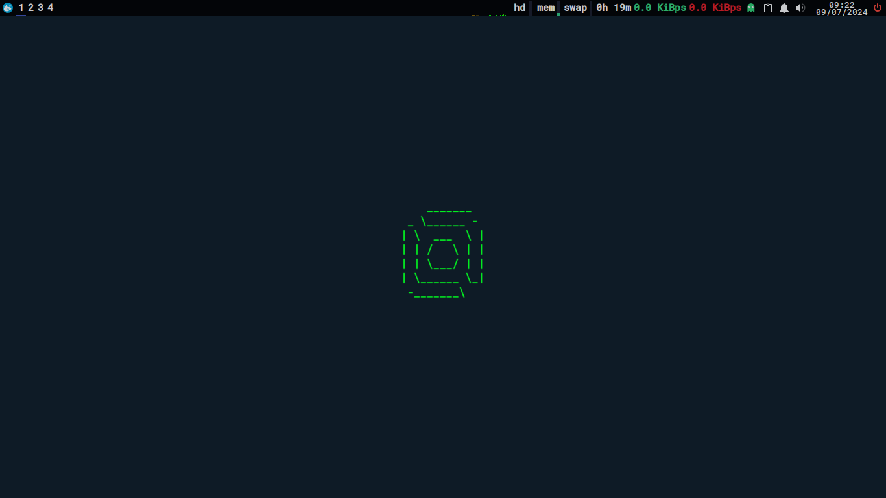

# xwdots


## xwdots

My dotfiles and scripts for personal use -- use at your own risk.

## Introduction

This repository contains my configuration files

and scripts, which make it easier to set up

my workstation(themes, icons, CLI tools, apps and more).

### Before starting

I use Void Linux, like this:
- Install the non-free repository
- xbps to install packages

NOTE: The settings and scripts are intended for my personal use,

so use at your own risk. Before using the files,

test in the VM, make the necessary changes, test again, then use on your machine.

### Installation

```sh
    git clone https://github.com/IsaquePFerreira/xwdots
    cd xwdots
    ./setup.sh
```

---

Made with ❤ and Bash

